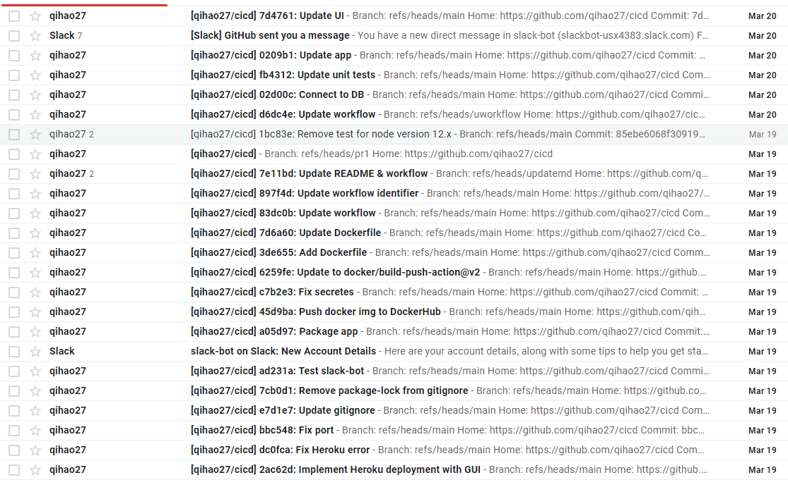
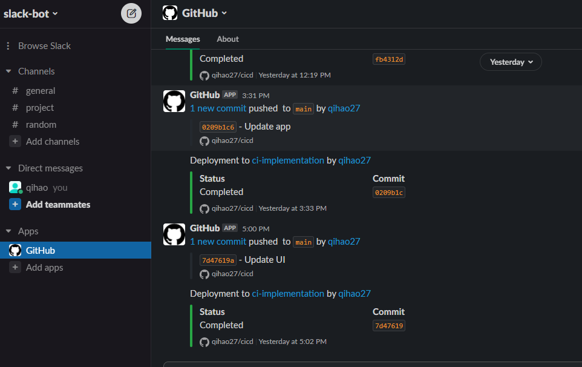

# CI/CD Implementation
[](https://github.com/qihao27/cicd/actions/workflows/test.yml)
[](https://github.com/qihao27/cicd/actions/workflows/docker-publish.yml)

[](https://qihao27.github.io/cicd) <br>
A GitHub repository that executes a workflow each time someone commits a change.

## Available Workflow
* Email notification on push to main branch
* Build/Test on push/pull request
* deploy to Heroku upon CI pass: https://ci-implementation.herokuapp.com
* subscribe to notifications for a repository with Slack
* test/publish docker image to DockerHub

### Email Notification
Github in-built: Settings > Integrations > Email notifications <br>


### Build/Test on Push/Pull Request
* Github Actions to setup workflow to run unit test with Jest
    * push on main branch
    * pull request on any branches other than main
* [workflow](https://github.com/qihao27/cicd/blob/main/.github/workflows/test.yml)

### Deploy to Heroku upon CI pass
Heroku in-built: Deploy > Automatic deploys > Enable Automatic deploys

### Slack: Subscribe to Notifications for a Repository
* add Github app to Slack
* subscribe to a repo
* customizable notification
* [Github for Slack](https://slack.com/help/articles/232289568-GitHub-for-Slack)




### Test/Publish Docker Image to DockerHub
* run unit tests on push to main branch
* build and publish docker image to DockerHub on tests pass
* [workflow](https://github.com/qihao27/cicd/blob/main/.github/workflows/docker-publish.yml)
* [Dockerfile](https://github.com/qihao27/cicd/blob/main/Dockerfile)
* [DockerHub Repo](https://hub.docker.com/r/wuqh07/cicd)
```
docker pull wuqh07/cicd:main
```

## Local Tests
* open /app/btn_ctrl.js
* comment first line and un-comment second line
```
// const url = "https://ci-implementation.herokuapp.com";
const url = "http://localhost:3000";
```
* run /app/main.js in terminal
```
node app/main.js
```
* open [localhost](http://localhost:3000/) in web browser

## Project Requirements
https://github.com/u1i/devops-course/blob/master/projects/tech.md
